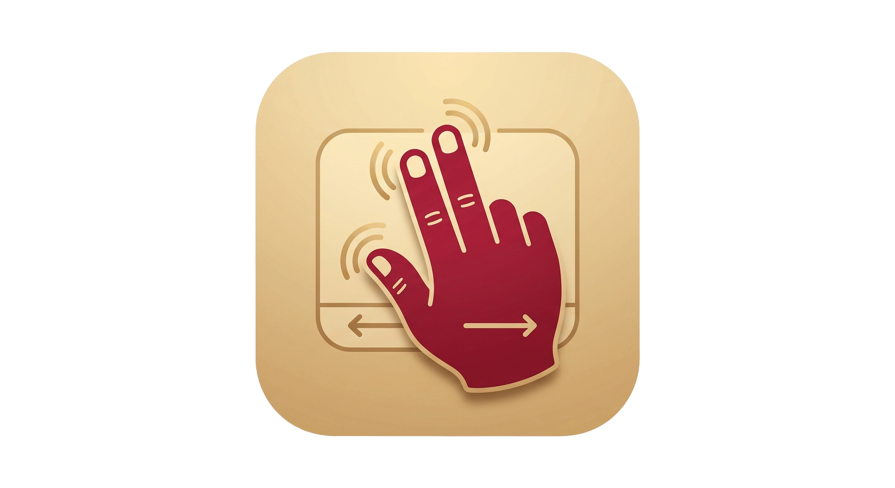

<p align="center">
  
</p>

<h1 align="center">2d.Scrollax</h1>

<p align="center">
  A tiny macOS menu bar app that gives your trackpad a voice — every scroll gesture
  triggers a short, tactile sound, so scrolling feels like moving something physical.
</p>

## Download

Grab the latest build from the [Releases page](https://github.com/2d-jack/2d.Scrollax/releases/tag/latest)
— it's rebuilt automatically from `main` on every push. Unzip it, move
`2d.Scrollax.app` to `/Applications`, then since it isn't notarized by Apple,
right-click it and choose **Open** the first time (or run
`xattr -cr /Applications/2d.Scrollax.app` in Terminal).

## What it does

Scrollax watches trackpad scroll events system-wide and turns raw scroll distance into
quantized "ticks." Each tick plays a short sound whose volume and pitch respond to how
fast you're scrolling, and an optional trackpad haptic pulse can ride along with it.
Multiple overlapping voices let fast scrolling layer sounds smoothly instead of
sounding like a machine gun of clicks.

All sounds are generated at runtime with a small procedural audio synthesizer — noise
bursts through resonant filters, envelopes, and pitch sweeps — rather than sampled from
any existing app. There are no bundled audio assets.

## Sound packs

- **Rubber Snap** — a dull, resonant pluck
- **Gluey Grip** — a longer, descending resonant drag
- **Mechanical Click** — a soft, damped tap
- **Soft Pop** — a muted sine "thock"

## Features

- Four built-in sound packs, switchable from the menu bar popover
- Volume and sensitivity (tick spacing) controls
- Optional Taptic Engine haptic feedback on scroll ticks
- Launch at login
- Runs as a menu bar–only accessory app (no Dock icon)

## Requirements

- macOS 13 or later
- Apple Silicon or Intel Mac with a Force Touch trackpad (for haptic feedback)

## Building

Requires Xcode Command Line Tools (`xcode-select --install`) or Xcode.

```sh
git clone https://github.com/2d-jack/2d.Scrollax.git
cd 2d.Scrollax
./build_app.sh
```

This produces `.build/app/2d.Scrollax.app`. Move it to `/Applications` and open it.

Since the app isn't notarized by Apple, Gatekeeper will block the first launch. Either
right-click the app and choose **Open**, or run:

```sh
xattr -cr /Applications/2d.Scrollax.app
```

### Running from source without packaging

```sh
swift run
```

## How it works

- `ScrollMonitor` installs a global `NSEvent` scroll wheel monitor, accumulates scroll
  distance, and fires a "tick" with an intensity derived from scroll velocity every time
  the accumulated distance crosses a threshold.
- `Synth` renders each sound pack procedurally using a state-variable filter, feeding it
  a short noise burst and letting the filter's own resonance ring out — this is what
  gives the tones their pitched, musical decay instead of sounding like raw noise.
- `AudioEngine` pre-renders a small pool of buffer variations per pack and plays them
  through a round-robin pool of `AVAudioEngine` player voices (with a peak limiter on
  the output) so fast, overlapping scrolling doesn't clip or cut sounds off.
- `HapticEngine` optionally fires `NSHapticFeedbackManager` alongside ticks, throttled
  to a sensible rate.

## License

Apache License 2.0 — see [LICENSE](LICENSE).
